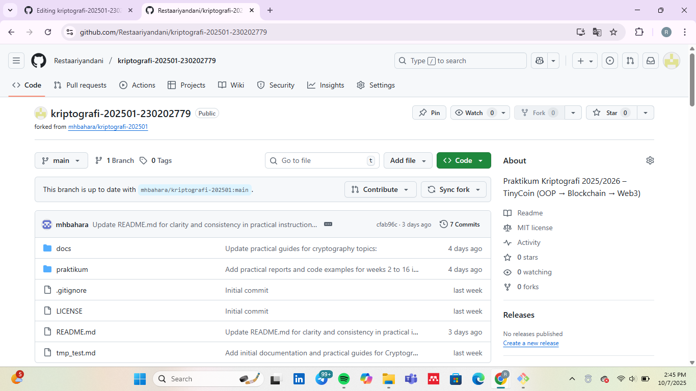

# Laporan Praktikum Kriptografi
Minggu ke-: 1  
Topik: [judul praktikum]  
Nama: Resta Ariyandani  
NIM: 230202779 
Kelas: 5IKRA 

## 1. Dasar Teori
Kpritrogafi klasik berkembang masa lampau dengan metode yang sangat sederhana yang berguna untuk menyembunyikan pesan. Contonya metode awal yaitu Caesar Cipher, yang digunakan oleh Julius Caesar yang di gunakan untuk mengirim pesan rahasia dengan cara menggeser huruf dalam bentuk alfabet dengan langkah tertentu. Vigenere ciper sendiri memperkenalkan kinci kata sandi yang lebih kompleks dengan teknik subtitusi polialfabetik, dan lebih meningkatkan keamanan dibandingkan metode sebelumnya.
Perkembangan kriptografi modern yang dimulai dengan munculnya algoritma yang lebih kompleks dan aman. Dua algoritma penting dalam periode ini adalah RSA dan AES. RSA sendiri merupakan algoritma asimetrisyang menggunakan pasangan kuci publik dan privat, sangat memungkinkan komunikasinya lebih aman dan tanda tangan digital, ini sangat penting untuk transaksi elektronik dan internet.
Selanjutnya yaitu Evolusi kriptografi kontemporer ini menghadirkan teknolohi yang baru yang menggabungkan konsep keamanan dan transparansi, seprti blockchain dan cryptocurrency, blockchain ialah sistem yang mencatat tansaksi dalam rantai blok yang terenkripsi, lebih sulis diubah dari pada yang sebelumnya tanpa persetujuan banyak pihak. Teknologi ini menjadim dasar bagi crytocurrency seperti Bitcoin.

## 2. Quis
1. Claude Shannon
2. - RSA (Rivest-Shamir-Adleman)
   - ECC (Elliptic Curve Cryptography)
   - Diffie-Hellman
   - DSA (Digital Signature Algorithm)
3. - Kriptografi klasik sendiri menggunakan teknk penyandian yang sederhana seperti pergantian dan pergeseran huruf, yaitu pada Caesar dan Vigenere Cipher. Yaitu dengan menggunakan satu kata kunci dan mudah dipecahkan karena pola hurufnya yang lebih dapat dianalisis.
   - Sedangkan kriptografi modern memanfaatkan algoritma matematis yang kompleks dengan kunnci simetris dan asimetris, seperti RSA dan ECC. Dan keamanan ini jauh lebih tinggi serta lebih mendukung fungsi tambahan.

