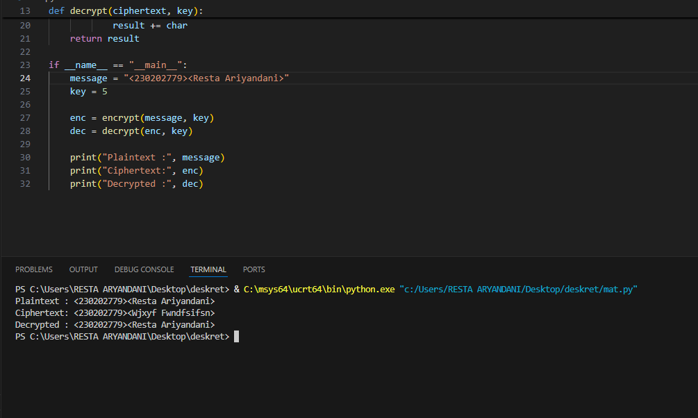

# Laporan Praktikum Kriptografi
Minggu ke-: 2 
Topik: Sistem Kripto 
Nama: Resta Ariyandani  
NIM: 230202779  
Kelas:5 IKRA  

---

## 1. Tujuan
Mengidentifikasi komponen dasar kriptosistem (plaintext, ciphertext, kunci, algoritma). Menggambarkan proses enkripsi dan dekripsi sederhana. Mengklasifikasikan jenis kriptosistem (simetris dan asimetris).

## 2. Dasar Teori
Kriptosistem merupakan suatu sistem dalam kriptografi yang terdiri dari sekumpulan algoritma yang berfungsi untuk memberikan layanan keamanan, seperti menjaga kerahasiaan data melalui proses enkripsi dan dekripsi pesan. Secara umum, kriptosistem memiliki tiga komponen utama, yaitu algoritma untuk pembangkitan kunci, proses enkripsi, dan proses dekripsi. Tingkat keamanan sistem ini sangat ditentukan oleh seberapa aman kunci yang digunakan.
## 3. Kode Sumber
# file: praktikum/week2-cryptosystem/src/simple_crypto.py

def encrypt(plaintext, key):
    result = ""
    for char in plaintext:
        if char.isalpha():
            shift = 65 if char.isupper() else 97
            result += chr((ord(char) - shift + key) % 26 + shift)
        else:
            result += char
    return result

def decrypt(ciphertext, key):
    result = ""
    for char in ciphertext:
        if char.isalpha():
            shift = 65 if char.isupper() else 97
            result += chr((ord(char) - shift - key) % 26 + shift)
        else:
            result += char
    return result

if __name__ == "__main__":
    message = "Cryptosystem Test"
    key = 5

    enc = encrypt(message, key)
    dec = decrypt(enc, key)

    print("Plaintext :", message)
    print("Ciphertext:", enc)
    print("Decrypted :", dec)

## 4. Hasil dan Pembahasan
(Tuliskan langkah yang dilakukan sesuai instruksi.  
Contoh format:
1. Membuat file `caesar_cipher.py` di folder `praktikum/week2-cryptosystem/src/`.
2. Menyalin kode program dari panduan praktikum.
3. Menjalankan program dengan perintah `python caesar_cipher.py`.)

---

## 5. Klasifikasi Simetris & Asimetris
1. kriptografi simetris, proses enkripsi dan dekripsi dilakukan menggunakan satu
   kunci yang sama. Dengan demikian, baik pengirim maupun penerima pesan harus
   memiliki kunci yang identik dan dijaga kerahasiaannya. Keunggulan utama dari
   metode ini adalah kecepatannya, karena algoritma yang digunakan relatif
   sederhana dan efisien dalam mengamankan data berukuran besar. Meski demikian,
   terdapat kelemahan dalam pendistribusian kunci, sebab kunci harus dikirim
   melalui jalur komunikasi yang aman. Apabila kunci tersebut bocor atau
   diketahui pihak lain, maka keamanan seluruh sistem dapat terancam. Beberapa
   algoritma yang menerapkan metode ini antara lain DES (Data Encryption
   Standard) dan AES (Advanced Encryption Standard).
   Contoh : a. AES (Advanced Encryption Standard): algoritma enkripsi yang sangat
   populer dan digunakan secara luas karena tingkat keamanannya tinggi serta
   performanya cepat. b. DES (Data Encryption Standard): algoritma yang
   dikembangkan oleh IBM pada tahun 1970-an, namun kini dianggap kurang aman
   terhadap serangan modern karena panjang kuncinya yang pendek.
3. Kriptografi asimetris memnafaatkan uda kunci yang berbeda namun saling
   terkait,yaitu kunci publik dan kunci privat. Kunci publik yang berfungsi untuk
   melakukan proses secara terbuka, sedangkan kunci privat digunakan untuk
   deskripsi dan harus dijaga kerahasiaannya oleh pemiliknya. Keunggulan utama
   dari kriptografi asimetris adalah tingkat keamanannya yang lebih tinggi dalam
   pertukaran kunci, karena tidak ada keharusan mengirimkan kunci rahasia melalui
   saluran komunikasi. Selain itu, sistem ini juga mendukung fitur tanda tangan
   digital dan autentikasi pengguna. Namun, proses enkripsi dan dekripsinya lebih
   lambat dibandingkan metode simetris karena algoritmanya lebih kompleks.
   Contoh : a. RSA (Rivest–Shamir–Adleman): algoritma yang paling banyak
   digunakan untuk keamanan data dan komunikasi digital karena keandalannya. b.
   ECC (Elliptic Curve Cryptography): algoritma modern yang menawarkan tingkat
   keamanan tinggi dengan ukuran kunci yang lebih kecil, sehingga lebih efisien
   untuk perangkat dengan sumber daya terbatas.

## 6. Pertanyaan Diskusi
1. Pembangkitan kunci berfungsi menghasilkan kunci rahasia yang unik, enkripsi
   mengubah pesan asli (plaintext) menjadi bentuk tersandi (ciphertext), dan
   dekripsi mengembalikan ciphertext menjadi plaintext menggunakan kunci yang
   sesuai. Ketiga komponen ini bekerja bersama untuk menjaga kerahasiaan dan
   keamanan data dalam sistem kriptografi.
2. Apa kelebihan dan kelemahan sistem simetri dibandingkan asimetris?
   Jawab : Kelebihan : 1. Proses enkripsi dan dekripsi lebih cepat dan efisien,
   2. karena hanya menggunakan satu kunci dan algoritmanya relatif sederhana.
   Kekurangan :1.  Menghadapi masalah dalam distribusi kunci, karena kunci harus
   dikirimkan kepada penerima melalui jalur yang aman. 2. Jika kunci diketahui
   oleh pihak lain, maka seluruh pesan dapat dibuka, sehingga keamanan sistem
   menjadi lemah. 3. Tidak dapat digunakan untuk tanda tangan digital atau
   autentikasi identitas secara langsung, berbeda dengan sistem asimetris.
3. Mengapa distribusi kunci masalah menjadi utama dalam kriptografi simetri?
   Jawab : Distribusi kunci menjadi masalah utama dalam kriptografi simetris
   karena menggunakan satu kunci yang sama untuk enkripsi dan dekripsi. Jika
   kunci bocor saat dikirim, pihak lain dapat membaca seluruh pesan, sehingga
   keamanan sistem terancam.
   
   

